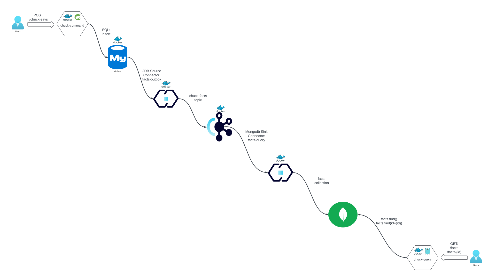

# Tarea de Microservicios

La figura muestra la arquitectura del sistema realizada en clase.

El sistema consta de varios componentes y servicios que interactúan entre sí para proporcionar una funcionalidad robusta y eficiente para gestionar y consultar "Chuck Norris Facts".

## Componentes y Servicios

### chuck-command

El servicio chuck-command es una aplicación Spring Boot que expone una API REST con un único endpoint: POST /chuck-says. Cuando se recibe una solicitud en este endpoint, el servicio inserta el hecho proporcionado en la tabla db.facts de una base de datos MySQL.

### fact-outbox connector

El conector fact-outbox es un conector Kafka Connect JDBC Source que monitorea la tabla db.facts en la base de datos MySQL. Cada vez que se inserta una nueva fila en esta tabla, el conector escribe este nuevo hecho en el topic Kafka chuck-facts utilizando el formato AVRO.

### fact-query connector

El conector fact-query es un conector Kafka Connect JDBC Sink que lee los mensajes del topic chuck-facts. Una vez que lee el contenido del topic, escribe un nuevo documento en la colección test.facts en MongoDB, respetando el esquema AVRO del topic.

### chuck-query

El servicio chuck-query es una aplicación escrita en Go que expone dos endpoints REST: GET /facts y GET /fact/{id}. Estos endpoints permiten ejecutar consultas sobre la colección test.facts en MongoDB y devolver los documentos correspondientes en formato JSON.

## Patrones de Interacción/Arquitectura Implementados

### Comunicación Síncrona Request/Response

La comunicación síncrona se implementa entre los servicios chuck-command y chuck-query. Los usuarios pueden enviar solicitudes al endpoint POST /chuck-says del servicio chuck-command, y posteriormente consultar los hechos almacenados utilizando los endpoints GET /facts y GET /fact/{id} del servicio chuck-query.

### Outbox Pattern

El patrón Outbox se utiliza para asegurar la consistencia eventual entre los servicios. El servicio chuck-command escribe de manera transaccional en la base de datos MySQL. El conector fact-outbox luego monitorea esta base de datos y publica los nuevos hechos como eventos en el topic Kafka chuck-facts. Esto asegura que cualquier cambio en la base de datos se refleje como un evento en Kafka, garantizando la consistencia eventual del sistema.

### CQRS (Command Query Responsibility Segregation)

El sistema implementa el patrón CQRS para separar las responsabilidades de comando y consulta. El conector fact-query lee el contenido del topic chuck-facts y escribe en la colección MongoDB test.facts. Esto permite que el servicio chuck-query, optimizado para la lectura, pueda acceder a una infraestructura diseñada específicamente para consultas, mientras que el servicio chuck-command se enfoca en manejar las operaciones de escritura. Este enfoque asegura una consistencia eventual y mejora el rendimiento del sistema al dividir claramente las operaciones de comando y consulta.

# Arquitectura del Sistema Chuck Norris Facts

## Ventajas de la Arquitectura

### Separación de Responsabilidades (CQRS)

- **Ventaja**: La separación entre comandos y consultas permite optimizar cada parte del sistema para sus respectivas tareas. Las operaciones de escritura se manejan de manera transaccional en una base de datos relacional (MySQL), mientras que las operaciones de lectura se realizan en una base de datos NoSQL (MongoDB) optimizada para consultas rápidas.
- **Desventaja**: La implementación de CQRS puede agregar complejidad al sistema debido a la necesidad de mantener la sincronización entre las bases de datos de comandos y consultas.

### Consistencia Eventual (Outbox Pattern)

- **Ventaja**: Utilizando el patrón Outbox, se garantiza que cualquier cambio en la base de datos de comandos eventualmente se refleje en la base de datos de consultas. Esto asegura la consistencia y la integridad de los datos a lo largo del sistema.
- **Desventaja**: La consistencia eventual significa que puede haber un pequeño retraso entre la escritura de un comando y la disponibilidad de los datos en el sistema de consultas.

### Escalabilidad

- **Ventaja**: Al dividir las responsabilidades entre diferentes servicios y bases de datos, el sistema puede escalar de manera más eficiente. Cada componente puede ser escalado independientemente según las necesidades de carga.
- **Desventaja**: La escalabilidad puede introducir complejidades adicionales en la gestión de los servicios y la infraestructura subyacente.

### Uso de Kafka

- **Ventaja**: Kafka proporciona una plataforma de mensajería robusta y escalable que permite una comunicación eficiente entre los componentes del sistema. Además, al utilizar Kafka Connect, se facilita la integración con diversas bases de datos y sistemas.
- **Desventaja**: La configuración y gestión de Kafka puede ser compleja, y su uso introduce dependencias adicionales en el sistema.

### Microservicios

- **Ventaja**: La arquitectura basada en microservicios permite desarrollar, desplegar y mantener cada componente de manera independiente. Esto facilita el desarrollo paralelo y mejora la resiliencia del sistema, ya que un fallo en un servicio no necesariamente afecta a los demás.
- **Desventaja**: La orquestación y comunicación entre microservicios puede ser compleja y requiere una infraestructura adicional, como herramientas de gestión de contenedores (por ejemplo, Kubernetes).

## Desventajas de la Arquitectura

### Complejidad

- **Desventaja**: La arquitectura introduce una complejidad significativa en el diseño, implementación y mantenimiento del sistema. La gestión de múltiples bases de datos, servicios y mecanismos de mensajería puede ser desafiante.
- **Ventaja**: Aunque la complejidad es una desventaja, también puede llevar a un diseño más robusto y escalable si se gestiona correctamente.

### Consistencia Eventual

- **Desventaja**: La consistencia eventual implica que los datos pueden no estar inmediatamente disponibles para las consultas después de una operación de escritura. Esto puede ser problemático para ciertas aplicaciones que requieren consistencia fuerte.
- **Ventaja**: La consistencia eventual permite una mayor escalabilidad y rendimiento, lo cual es beneficioso para muchas aplicaciones modernas.

### Requiere Infraestructura Adicional

- **Desventaja**: El uso de Kafka y múltiples bases de datos requiere una infraestructura adicional, lo que puede aumentar los costos operativos y la carga administrativa.
- **Ventaja**: La infraestructura adicional proporciona beneficios como la escalabilidad y la resiliencia, que pueden justificar los costos adicionales en aplicaciones de gran escala.

### Mantenimiento y Actualizaciones

- **Desventaja**: El mantenimiento y las actualizaciones de un sistema distribuido pueden ser más complicados, ya que cada servicio y componente puede tener dependencias y versiones diferentes.
- **Ventaja**: La modularidad de los microservicios facilita la actualización de componentes individuales sin afectar el sistema completo.

## Conclusión

La arquitectura propuesta ofrece numerosas ventajas en términos de escalabilidad, separación de responsabilidades y resiliencia. Sin embargo, también introduce complejidades y desafíos en la gestión y mantenimiento del sistema. La elección de esta arquitectura debe balancear estos factores según los requisitos específicos del proyecto y las capacidades del equipo de desarrollo.

Sin embargo, para la propuesta pequeña de la tarea, no se justifica la complejidad, por lo que el problema puede ser resuelto con una simple aplicación **flask** escrita en Python utilizando **sqllite**, que se adjunta. El archivo **swagger.yaml** describe la forma de interacción. Además se adjuntan los archivos de **deployments** para kubernetes. La versión dockerizada de la aplicación puede bajarse del Dockerhub **esicardi**: [esicardi/chuck-facts](https://hub.docker.com/repository/docker/esicardi/chuck-facts/general)

